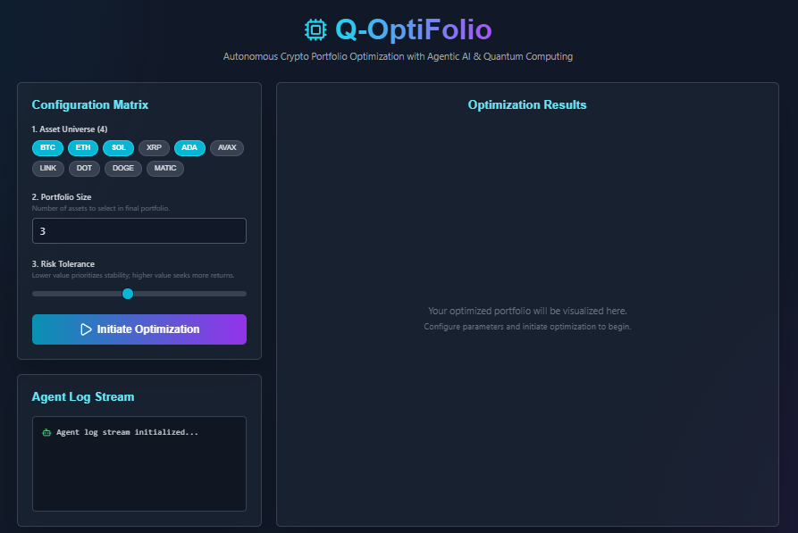
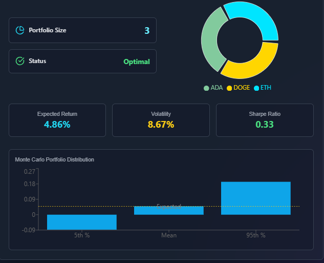

# Q-OptiFolio: Autonomous Crypto Portfolio Optimization

<p align="center">
  
  
  
  
  
</p>

<p align="center">
  
</p>

*Note: You will need to upload your screenshot to an image hosting service like Imgur and replace the URL above.*

## 🎥 Live Demo

See Q-OptiFolio in action! This video demonstrates the full workflow, from configuring the optimization parameters on the frontend to receiving the final, detailed investment report generated by the AI agents and the quantum algorithm. Click below on Image or (https://youtu.be/HNmMWfzpmMU)

<p align="center">
  <a href="[https://www.youtube.com/watch?v=your-video-id](https://youtu.be/HNmMWfzpmMU)">
    
  </a>
</p>

*Note: You will need to record a demo, upload it to YouTube, and replace "your-video-id" in the links above.*

## ✨ Key Features

- **Interactive Dashboard**: A professional "mission control" UI built with Next.js and Tailwind CSS for configuring optimization parameters and visualizing results.
- **Autonomous AI Agents**: A team of specialized AI agents (managed by CrewAI) that automate the entire analysis pipeline, including data gathering, optimization, and reporting.
- **Quantum-Powered Optimization**: Implements the Quantum Approximate Optimization Algorithm (QAOA) using IBM's Qiskit to efficiently solve the complex combinatorial problem of asset selection.
- **Advanced Financial Metrics**: The system calculates and displays key metrics, including Expected Return, Volatility, Sharpe Ratio, and Monte Carlo simulation results.
- **Real-Time Logging**: A "cinematic" log stream with a typing animation and sound effects provides a transparent, engaging view into the agents' decision-making process.

## 🏛️ Project Architecture & Pipeline

The application follows a modern, decoupled architecture with a clear data flow from the client to the quantum core and back.

```plaintext
+--------------------------+
|   Frontend (Next.js)     |
| - User Configuration     |
| - Results Visualization  |
+--------------------------+
           |
           | (HTTP POST Request to /optimize)
           v
+--------------------------+
|  Backend API (Litestar)  |
| - Receives & Validates   |
| - Initiates Crew         |
+--------------------------+
           |
           | (CrewAI Workflow Begins)
           v
+--------------------------+      +-------------------------+      +--------------------------+
|   Agent 1:               |----->|   Agent 2:              |----->|   Agent 3:               |
|   Market Analyst         |      |   Quantum Strategist    |      |   AI Financial Advisor   |
|   (Fetches Market Data)  |      |   (Runs Quantum Core)   |      |   (Writes Final Report)  |
+--------------------------+      +-------------------------+      +--------------------------+
                                             |
                                             | (Calls Qiskit Function)
                                             v
                                  +--------------------------+
                                  |   Quantum Core (Qiskit)  |
                                  | - Formulates QUBO        |
                                  | - Solves with QAOA       |
                                  +--------------------------+
## 🛠️ Technology Stack

This project utilizes a modern, high-performance technology stack across the full spectrum of development.

| Category          | Technology                                                                                                  | Purpose                                                                                |
| ----------------- | ----------------------------------------------------------------------------------------------------------- | -------------------------------------------------------------------------------------- |
| **Frontend** | `Next.js (React)`, `Tailwind CSS`, `Recharts`, `Lucide-React`, `Tone.js`                                      | Building a responsive, interactive, and aesthetically advanced user interface.         |
| **Backend** | `Python`, `Litestar`, `MsgSpec`, `Uvicorn`                                                                  | Creating a high-performance, asynchronous, and type-safe RESTful API server.           |
| **AI & LLM** | `CrewAI`, `LangChain`, `Groq Llama3`                                                                          | Orchestrating the autonomous agent workflow and providing the core reasoning engine.     |
| **Quantum** | `IBM Qiskit`, `Qiskit Aer`                                                                                    | Implementing and simulating the QAOA algorithm for portfolio optimization.             |
| **Data** | `CoinGecko API`, `NumPy`                                                                                      | Sourcing real-time financial data and performing numerical computations.               |

---

## 🚀 Getting Started

To get a local copy up and running, follow these simple steps.

### Prerequisites

- Node.js and npm (for the frontend)
- Python 3.10+ and Pip (or a virtual environment manager like Conda)
- A Groq API Key

### Installation & Setup

1.  **Clone the repository:**
    ```bash
    git clone [https://github.com/your-username/q-optifolio-dashboard.git](https://github.com/your-username/q-optifolio-dashboard.git)
    cd q-optifolio-dashboard
    ```

2.  **Setup the Backend:**
    - Navigate to the backend directory: `cd app/backend`
    - Create a virtual environment: `python -m venv venv` and activate it.
    - Install the required Python packages: `pip install -r requirements.txt`
    - Create a `.env` file and add your Groq API key:
      ```
      GROQ_API_KEY="your_api_key_here"
      ```

3.  **Setup the Frontend:**
    - Navigate to the project's root directory.
    - Install the required npm packages: `npm install`

### Running the Application

1.  **Start the Backend Server:**
    - From the `app/backend` directory, run:
      ```bash
      python main.py
      ```
    - The server should now be running on `http://localhost:8000`.

2.  **Start the Frontend Development Server:**
    - From the project's root directory, run:

```bash
npm run dev
# or
yarn dev
# or
pnpm dev
# or
bun dev
```

Open [http://localhost:3000](http://localhost:3000) with your browser to see the result.

You can start editing the page by modifying `app/page.js`. The page auto-updates as you edit the file.

This project uses [`next/font`](https://nextjs.org/docs/app/building-your-application/optimizing/fonts) to automatically optimize and load [Geist](https://vercel.com/font), a new font family for Vercel.

## Learn More

To learn more about Next.js, take a look at the following resources:

- [Next.js Documentation](https://nextjs.org/docs) - learn about Next.js features and API.
- [Learn Next.js](https://nextjs.org/learn) - an interactive Next.js tutorial.

You can check out [the Next.js GitHub repository](https://github.com/vercel/next.js) - your feedback and contributions are welcome!

## Deploy on Vercel

The easiest way to deploy your Next.js app is to use the [Vercel Platform](https://vercel.com/new?utm_medium=default-template&filter=next.js&utm_source=create-next-app&utm_campaign=create-next-app-readme) from the creators of Next.js.

Check out our [Next.js deployment documentation](https://nextjs.org/docs/app/building-your-application/deploying) for more details.
